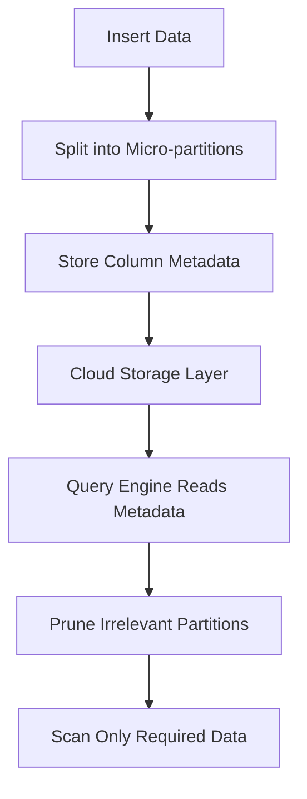
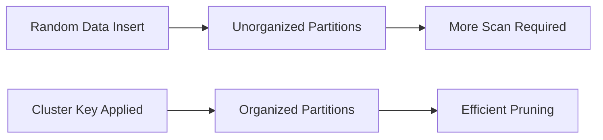
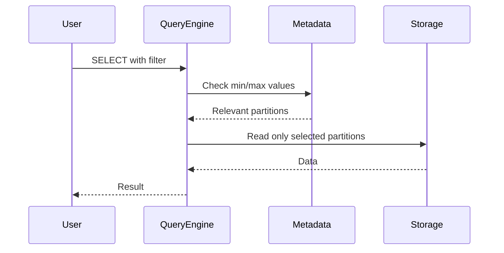
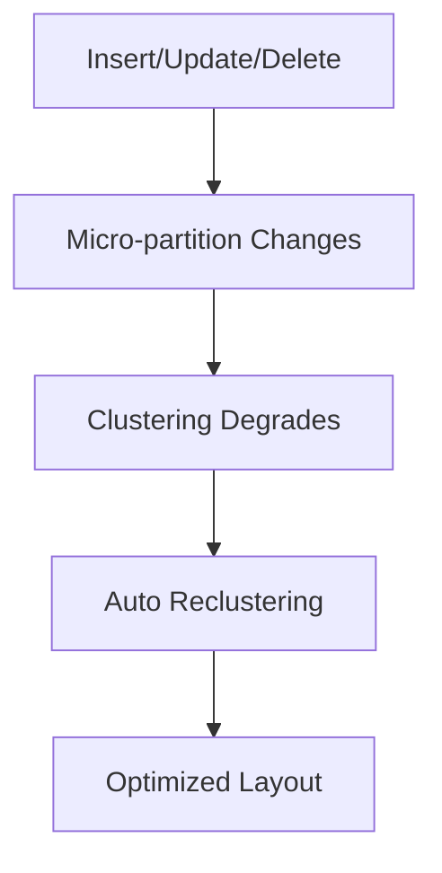
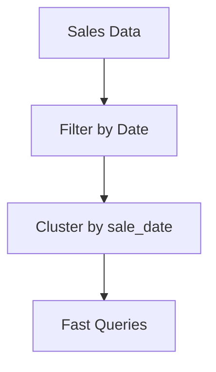

# ❄️ Snowflake Cluster Key — In-Depth Guide

---

# 1. Overview

A **cluster key** in Snowflake is a mechanism to influence how data is **physically organized inside micro-partitions** to improve query performance through **partition pruning**.

Snowflake does **not use traditional indexes, DISTKEY, or SORTKEY**. Instead, it relies on:

- Micro-partitions (~16MB compressed)
- Metadata (min/max values, stats)
- Automatic pruning

Cluster keys enhance this system.

---

# 2. How Snowflake Stores Data

## 2.1 Micro-Partitioning

When data is inserted:

- Data is split into micro-partitions
- Each partition stores:
  - Column min/max values
  - Distinct counts
  - Metadata for pruning

---

## 2.2 Storage Flow



---

# 3. What Cluster Key Does

Cluster key influences:

- How new data is written
- How existing data is reorganized (reclustering)

It ensures:

👉 Similar values are stored close together

---

## 3.1 Logical Effect



---

# 4. Creating Cluster Keys

## 4.1 Single Column

```sql
CREATE TABLE orders (
    order_id INT,
    order_date DATE,
    amount NUMBER
)
CLUSTER BY (order_date);
```

---

## 4.2 Multi-Column

```sql
CREATE TABLE orders (
    order_id INT,
    customer_id INT,
    order_date DATE
)
CLUSTER BY (customer_id, order_date);
```

---

## 4.3 Expression-Based

```sql
CREATE TABLE events (
    event_time TIMESTAMP
)
CLUSTER BY (DATE(event_time));
```

---

# 5. Altering Cluster Keys

## 5.1 Add Cluster Key

```sql
ALTER TABLE orders
CLUSTER BY (order_date);
```

## 5.2 Modify Cluster Key

```sql
ALTER TABLE orders
CLUSTER BY (customer_id, order_date);
```

## 5.3 Drop Cluster Key

```sql
ALTER TABLE orders
DROP CLUSTERING KEY;
```

---

# 6. Automatic Clustering

```sql
ALTER TABLE orders SET AUTO_CLUSTERING = TRUE;
```

---

# 7. Query Execution with Cluster Key



---

# 8. Effective Usage in Queries

## 8.1 Best Case

```sql
SELECT *
FROM orders
WHERE order_date = '2025-01-01';
```

## 8.2 Range Queries

```sql
SELECT *
FROM orders
WHERE order_date BETWEEN '2025-01-01' AND '2025-01-10';
```

## 8.3 Multi-column Filtering

```sql
SELECT *
FROM orders
WHERE customer_id = 100
AND order_date = '2025-01-01';
```

---

# 9. DML Impact

## INSERT
- New data may not follow clustering immediately

## UPDATE / DELETE
- Causes fragmentation
- Requires reclustering

---

## 9.1 DML Flow



---

# 10. Clustering Metrics

## Check clustering info

```sql
SELECT SYSTEM$CLUSTERING_INFORMATION('orders');
```

---

# 11. When to Use Cluster Key

✅ Large tables (>100GB)

✅ Frequent filters on specific columns

✅ Range queries (dates, numeric ranges)

✅ Analytical workloads

---

## Example Use Case



---

# 12. When NOT to Use

❌ Small tables

❌ High-cardinality random values (UUID)

❌ Frequently updated columns

❌ Tables with low query filtering

---

# 13. Performance Considerations

## 13.1 Benefits
- Reduced scan cost
- Faster query execution
- Better pruning

## 13.2 Costs
- Reclustering compute cost
- Maintenance overhead

---

# 14. Best Practices

- Use 1–3 columns max
- Prefer columns used in WHERE clause
- Use range-friendly columns (dates, IDs)
- Monitor clustering depth

---

# 15. Advanced Patterns

## Time-Based Clustering

```sql
CLUSTER BY (YEAR(order_date), MONTH(order_date));
```

## Skew Handling

```sql
CLUSTER BY (region_id);
```

---

# 16. Summary

Cluster keys in Snowflake:

- Improve performance via partition pruning
- Organize micro-partitions
- Are optional but powerful for large datasets

---

# 17. Interview One-Liner

A cluster key is used to organize data in micro-partitions to improve query performance by enabling efficient partition pruning.

---

# 18. End-to-End Example

```sql
CREATE TABLE sales (
    id INT,
    region STRING,
    sale_date DATE,
    revenue NUMBER
)
CLUSTER BY (sale_date);

INSERT INTO sales VALUES
(1, 'US', '2025-01-01', 100),
(2, 'IN', '2025-01-02', 200);

SELECT * FROM sales
WHERE sale_date = '2025-01-01';
```

---

**End of Document**
