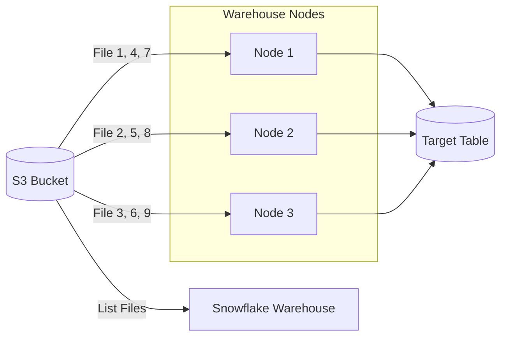

# ❄️ Snowflake Data Ingestion & AWS Integration Guide

---

# 1. Ingestion Scenarios & Best Practices

## 1.1 High Number of Files (CSV or Parquet)
Snowflake handles thousands of files efficiently using **Parallel Processing**. 

| Scenario | Strategy | Optimization |
|----------|----------|--------------|
| **High Number of CSVs** | Use `PATTERN` in `COPY INTO` | Target file size 10MB–100MB compressed. |
| **High Volume CSV** | Split the file | One giant 100GB file is slow; 1000 x 100MB files are lightning fast. |
| **High Number of Parquets** | `MATCH_BY_COLUMN_NAME` | Leverage schema-on-read; Parquet is faster to load than CSV due to metadata. |

---

# 2. Parallel Loading Architecture

Snowflake's query engine uses "Massively Parallel Processing" (MPP). When you run a `COPY` command, the Warehouse nodes divide the file list among themselves.



---

# 3. Applying Transformations during Load

You don't always need a separate ETL tool. Snowflake can transform data *during* the `COPY INTO` command.

```sql
COPY INTO target_table
FROM (
  SELECT 
    $1:id::int,               -- Column Casting
    UPPER($1:name::string),   -- String functions
    METADATA$FILENAME,        -- Metadata tracking
    CURRENT_TIMESTAMP()       -- Load timestamp
  FROM @my_s3_stage
)
FILE_FORMAT = (TYPE = 'PARQUET');
```

---

# 4. Triggering Jobs on File Creation

## 4.1 Real-time: Snowpipe
Snowpipe uses S3 Event Notifications (SQS) to trigger a load as soon as a file hits the bucket.

## 4.2 Batch: Tasks & Directory Tables
For batch, you can use a **Directory Table** on your stage and a **Stream** to trigger a **Task** only when new files are detected.

| Feature | Snowpipe (Real-time) | Tasks (Batch) |
|---------|----------------------|---------------|
| **Trigger** | S3 Event (SQS) | Schedule (e.g., every 1 hour) |
| **Cost** | Per-file overhead + Serverless | Warehouse compute |
| **Latency** | Seconds | Minutes/Hours |

---

# 5. Snowflake & AWS Connection (The "Pull" Model)

Snowflake uses a **Pull Model**. 
1. AWS "Pushes" a notification (optional for Snowpipe).
2. Snowflake "Pulls" the data from S3 using a **Storage Integration**.

---

# 6. AWS Side Checklist (Order of Operations)

### ✅ Step 1: Create S3 Bucket
Create a bucket (e.g., `s3://ti-data-lake/`).

### ✅ Step 2: Create IAM Policy
Create a policy named `Snowflake_S3_Access_Policy`.
```json
{
    "Version": "2012-10-17",
    "Statement": [
        {
            "Effect": "Allow",
            "Action": ["s3:GetObject", "s3:GetObjectVersion"],
            "Resource": "arn:aws:s3:::ti-data-lake/*"
        },
        {
            "Effect": "Allow",
            "Action": ["s3:ListBucket", "s3:GetBucketLocation"],
            "Resource": "arn:aws:s3:::ti-data-lake"
        }
    ]
}
```

### ✅ Step 3: Create IAM Role
1. Create a Role (e.g., `Snowflake_S3_Role`).
2. Attach the policy from Step 2.
3. **Temporary Trust Relationship:** Set the trusted entity to your own AWS Account ID for now (we will update this later).

---

# 7. Snowflake Side Checklist (Order of Operations)

### ✅ Step 1: Create Storage Integration
This object stores the AWS ARN and allows Snowflake to assume the IAM role.
```sql
CREATE OR REPLACE STORAGE INTEGRATION s3_int
  TYPE = EXTERNAL_STAGE
  STORAGE_PROVIDER = 'S3'
  ENABLED = TRUE
  STORAGE_AWS_ROLE_ARN = 'arn:aws:iam::123456789012:role/Snowflake_S3_Role'
  STORAGE_ALLOWED_LOCATIONS = ('s3://ti-data-lake/');
```

### ✅ Step 2: Retrieve Identity Details
Run this command to get the `STORAGE_AWS_IAM_USER_ARN` and `STORAGE_AWS_EXTERNAL_ID`.
```sql
DESC INTEGRATION s3_int;
```

### ✅ Step 3: UPDATE AWS Trust Relationship (CRITICAL)
Go back to the AWS IAM Role > **Trust Relationships** and update it with the values from Step 2.
```json
{
  "Version": "2012-10-17",
  "Statement": [
    {
      "Effect": "Allow",
      "Principal": { "AWS": "<STORAGE_AWS_IAM_USER_ARN>" },
      "Condition": {
        "StringEquals": { "sts:ExternalId": "<STORAGE_AWS_EXTERNAL_ID>" }
      },
      "Action": "sts:AssumeRole"
    }
  ]
}
```

### ✅ Step 4: Create External Stage
```sql
CREATE STAGE my_s3_stage
  STORAGE_INTEGRATION = s3_int
  URL = 's3://ti-data-lake/'
  FILE_FORMAT = (TYPE = 'CSV' SKIP_HEADER = 1);
```

---

# 8. Final Code: Triggering Ingestion

### Scenario A: Batch Load (Manual or via Task)
```sql
COPY INTO my_table
FROM @my_s3_stage
PATTERN='.*sales_2025.*\.csv';
```

### Scenario B: Real-time (Snowpipe)
```sql
CREATE OR REPLACE PIPE my_pipe
  AUTO_INGEST = TRUE
  AS
  COPY INTO my_table FROM @my_s3_stage;

-- Note: Run DESC PIPE my_pipe to get the SQS ARN and add it to 
-- S3 Bucket > Properties > Event Notifications.
```

---

# 9. Troubleshooting Checklist

1. **Access Denied?** Check the AWS Trust Relationship and the `STORAGE_ALLOWED_LOCATIONS` in the Integration object.
2. **Files not loading?** Snowpipe ignores files already in the bucket. Use `ALTER PIPE ... REFRESH` for existing files.
3. **Schema mismatch?** Use `ON_ERROR = CONTINUE` or `ON_ERROR = ABORT_STATEMENT` to handle data quality.
4. **Slow performance?** Check if you are using an appropriately sized Warehouse (Small/Medium for high volume).

---

# 10. Summary Table

| Task | AWS Action | Snowflake Action |
|------|------------|------------------|
| **Security** | Create IAM Role & Policy | Create Storage Integration |
| **Handshake** | Update Trust Relationship | `DESC INTEGRATION` |
| **Connectivity**| Provide S3 URL | Create External Stage |
| **Ingestion** | Drop files in S3 | `COPY INTO` or `SNOWPIPE` |

---
**End of Document**