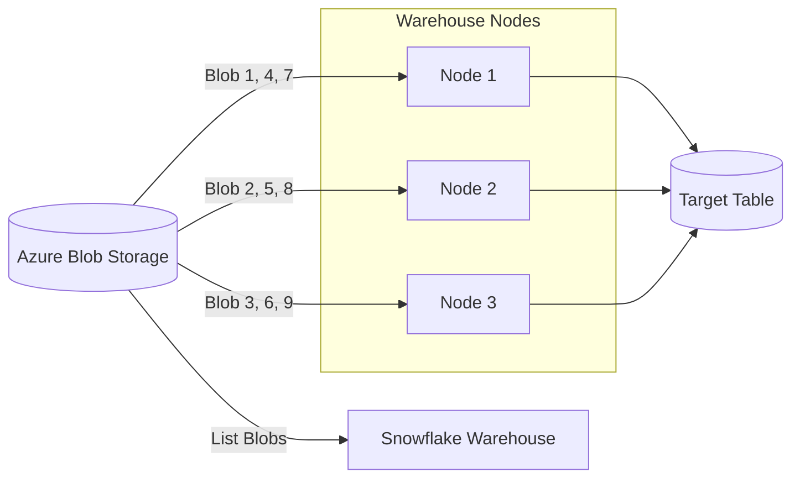

# ❄️ Snowflake Data Ingestion & Azure Integration Guide

---

# 1. Ingestion Scenarios & Best Practices

## 1.1 High Number of Files (CSV or Parquet)
Snowflake utilizes its MPP (Massively Parallel Processing) architecture to load files from Azure Blob Storage in parallel.

| Scenario | Strategy | Optimization |
|----------|----------|--------------|
| **High Number of CSVs** | Use `PATTERN` in `COPY INTO` | Ensure files are between 10MB and 100MB compressed. |
| **High Volume CSV** | Split the file | Avoid single large files (e.g., 50GB). Split into 500 x 100MB files for maximum thread utilization. |
| **High Number of Parquets** | `MATCH_BY_COLUMN_NAME` | Parquet metadata allows Snowflake to skip header parsing, making it faster than CSV. |

---

# 2. Parallel Loading Architecture

When loading from Azure, Snowflake's Virtual Warehouse nodes distribute the file list and pull data chunks simultaneously.



---

# 3. Applying Transformations during Load

You can perform "Extract-Transform-Load" (ETL) directly within the `COPY INTO` statement to avoid landing raw data in your final tables.

```sql
COPY INTO target_table
FROM (
  SELECT 
    $1:id::int,               -- Data Casting
    LOWER($1:email::string),  -- String manipulation
    METADATA$FILENAME,        -- Track source file
    METADATA$FILE_ROW_NUMBER  -- Track row position
  FROM @my_azure_stage
)
FILE_FORMAT = (TYPE = 'CSV' PARSE_HEADER = TRUE);
```

---

# 4. Triggering Jobs on File Creation

## 4.1 Real-time: Snowpipe (Azure Event Grid)
Snowpipe uses **Azure Event Grid** and **Azure Storage Queues**. When a blob is created, Event Grid sends a message to the Queue, which Snowpipe polls to trigger the load.

## 4.2 Batch: Tasks & Directory Tables
For batch loads (e.g., every 4 hours), use a **Directory Table** on the stage. A **Stream** tracks new files, and a **Task** executes the `COPY` command only if the Stream has data.

---

# 5. Snowflake & Azure Connection (The "Pull" Model)

Snowflake uses a **Pull Model** via a **Storage Integration**.
1. Snowflake creates an "App Registration" (Service Principal) in its own tenant.
2. You grant that Service Principal permissions to your Azure Storage Account.
3. Snowflake "Pulls" data using the Integration's identity.

---

# 6. Azure Side Checklist (Order of Operations)

### ✅ Step 1: Create Storage Account & Container
Create a Storage Account (e.g., `tistorageacct`) and a container (e.g., `data-lake`).

### ✅ Step 2: Identify Tenant ID
Obtain your **Azure Directory (tenant) ID** from the Azure Portal (Azure Active Directory > Properties).

### ✅ Step 3: Configure Network (Optional)
If using a Firewall on the Storage Account, ensure Snowflake's VNet/IPs are whitelisted.

### ✅ Step 4: Grant Access (After Snowflake Step 2)
Once you have the Snowflake Service Principal name from Snowflake:
1. Go to Storage Account > **Access Control (IAM)**.
2. Add Role Assignment: **Storage Blob Data Contributor** (or Reader).
3. Assign access to the Snowflake Service Principal.

---

# 7. Snowflake Side Checklist (Order of Operations)

### ✅ Step 1: Create Storage Integration
```sql
CREATE OR REPLACE STORAGE INTEGRATION azure_int
  TYPE = EXTERNAL_STAGE
  STORAGE_PROVIDER = 'AZURE'
  ENABLED = TRUE
  AZURE_TENANT_ID = '<your_azure_tenant_id>'
  STORAGE_ALLOWED_LOCATIONS = ('azure://tistorageacct.blob.core.windows.net/data-lake/');
```

### ✅ Step 2: Retrieve Identity Details & Consent
Run this command to get the `AZURE_CONSENT_URL` and `AZURE_MULTI_TENANT_APP_NAME`.
```sql
DESC INTEGRATION azure_int;
```
**Action:** Copy the `AZURE_CONSENT_URL` into a browser and click **Accept**. This authorizes the Snowflake app in your Azure tenant.

### ✅ Step 3: Create External Stage
```sql
CREATE STAGE my_azure_stage
  STORAGE_INTEGRATION = azure_int
  URL = 'azure://tistorageacct.blob.core.windows.net/data-lake/'
  FILE_FORMAT = (TYPE = 'PARQUET');
```

---

# 8. Final Code: Triggering Ingestion

### Scenario A: Batch Load (Manual/Scheduled)
```sql
COPY INTO sales_table
FROM @my_azure_stage
PATTERN='.*2025/02/.*\.parquet';
```

### Scenario B: Real-time (Snowpipe)
1. Create the Pipe:
```sql
CREATE OR REPLACE PIPE azure_pipe
  AUTO_INGEST = TRUE
  INTEGRATION = 'AZURE_EVENT_GRID_INTEGRATION' -- Requires a Notification Integration
  AS
  COPY INTO sales_table FROM @my_azure_stage;
```
2. Run `DESC PIPE azure_pipe` to get the **notification_channel** (Queue URL).
3. Create an **Azure Event Grid Subscription** using that Queue URL as the endpoint.

---

# 9. Troubleshooting Checklist

1. **403 Forbidden?** Ensure the "Accept Consent" step was performed and the Service Principal has "Storage Blob Data Contributor" role in Azure.
2. **Pipe not loading?** Check `SELECT SYSTEM$PIPE_STATUS('azure_pipe')`. If the `last_ingested_timestamp` is old, check the Event Grid subscription.
3. **Partial Loads?** Use `ON_ERROR = 'CONTINUE'` to load valid rows and check the `REJECTED_RECORD` output for errors.

---

# 10. Summary Table

| Task | Azure Action | Snowflake Action |
|------|--------------|------------------|
| **Identity** | Provide Tenant ID | Create Storage Integration |
| **Handshake** | Accept Consent URL | `DESC INTEGRATION` |
| **RBAC** | Assign "Storage Blob Data Contributor" | Create External Stage |
| **Real-time**| Create Event Grid + Queue | Create Pipe (Auto Ingest) |

---
**End of Document**