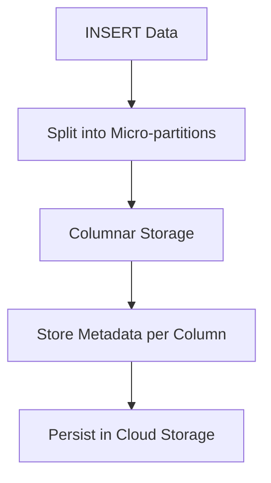
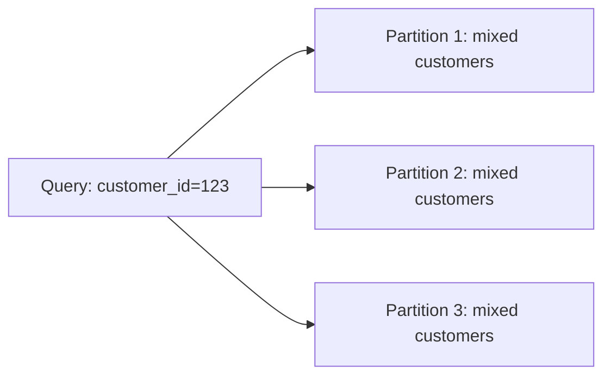
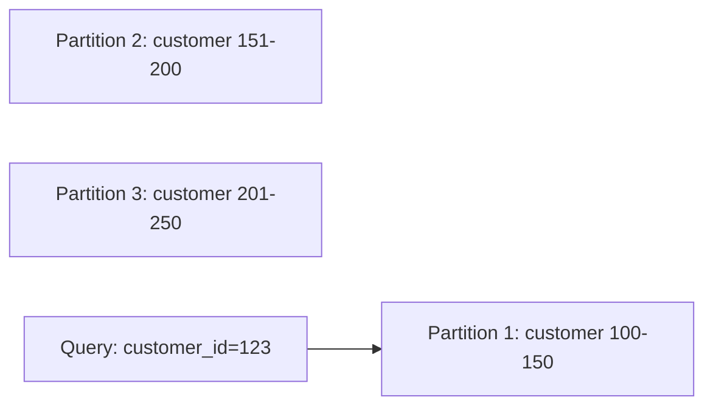

# ❄️ Snowflake Micro-Partitioning — In-Depth Guide

---

# 1. No Fixed Partition Columns

Snowflake does NOT use manual partitioning like Hive/BigQuery.

- ❌ No partition column
- ❌ No manual partition management
- ✅ All columns exist in every micro-partition

---

# 2. What is Micro-Partitioning?

When data is inserted into Snowflake:

- Data is split into micro-partitions (~16MB compressed)
- Stored in columnar format
- Metadata is collected per column

Metadata includes:
- Min value
- Max value
- Null count
- Distinct count (approx)

---

# 3. Data Storage Flow



---

# 4. Query Execution & Pruning

Example query:

```sql
SELECT * FROM orders WHERE order_date = '2025-01-01';
```

Execution steps:
1. Check metadata (min/max values)
2. Identify relevant partitions
3. Skip irrelevant partitions
4. Scan only required data

This is called **partition pruning**.

---

# 5. What Determines Micro-Partition Layout?

## 5.1 Insert Order (Very Important)

```sql
INSERT INTO orders
SELECT * FROM staging
ORDER BY order_date;
```

- Data inserted together → stored together
- Leads to natural clustering

---

## 5.2 Data Load Pattern

- Batch loads → better grouping
- Random inserts → scattered partitions

---

## 5.3 Reclustering

- Snowflake reorganizes data using cluster keys
- Improves pruning efficiency

---

# 6. Problem: Filtering on Non-Aligned Columns

Example:

```sql
SELECT * FROM orders WHERE customer_id = 123;
```

If data is organized by order_date:
- customer_id is spread across partitions
- More partitions scanned → slower performance

---

# 7. Solutions

## 7.1 Cluster Key

```sql
ALTER TABLE orders
CLUSTER BY (customer_id);
```

---

## 7.2 Multi-Column Clustering

```sql
CLUSTER BY (customer_id, order_date);
```

---

## 7.3 Improve Insert Pattern

```sql
INSERT INTO orders
SELECT * FROM staging
ORDER BY customer_id;
```

---

## 7.4 Materialized View

```sql
CREATE MATERIALIZED VIEW mv_orders AS
SELECT * FROM orders;
```

---

## 7.5 Search Optimization

```sql
ALTER TABLE orders
ADD SEARCH OPTIMIZATION ON (customer_id);
```

---

# 8. Visualization

## Without Clustering



---

## With Clustering



---

# 9. Trade-offs

| Approach | Benefit | Cost |
|--------|--------|------|
| Natural clustering | Free | Less control |
| Cluster key | High performance | Compute cost |
| Search optimization | Fast lookup | Costly |
| Materialized view | Precomputed | Storage + refresh |

---

# 10. Key Takeaways

- No fixed partition column
- All columns exist in each micro-partition
- Performance depends on metadata pruning
- Insert order matters
- Cluster keys help align data with query patterns

---

# 11. Interview Answer

Snowflake automatically partitions data into micro-partitions based on insertion order. All columns are stored in each partition, and metadata enables pruning. If queries use non-aligned columns, clustering or search optimization improves performance.

---

**End of Document**
